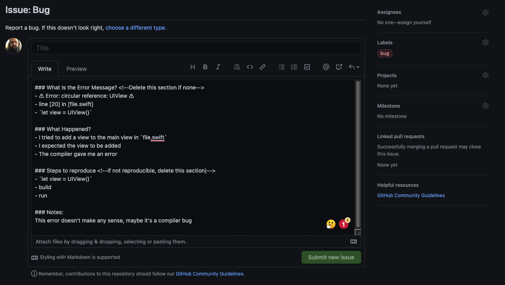

# BadgeGenerator

Generate a "badge" (circular label) for any view and place it in the center or any corner of a given view

`BadgeGenerator` uses a lightweight, easy to understand approach to make a circular UILabel with the given text

- platform: iOS
- extends: UIView
  - @discardableResult public func setBadge(in direction: BadgeDirection, with text: String) -> BadgeLabel<br>
    - adds a new badge to the view in the given location (BadgeDirection) <br>
    
### Installation:

In your Xcode project, simply go to File -> Swift Packages -> Add Package Dependency
use this repo's URL: https://github.com/froggomad/BadgeGenerator

### Usage:

```swift
let myView = UIView()
// create and hold a reference to a badge
let badge = myView.setBadge(in: .northWest, with: "1")
// later when an event happens that you want to increment
let value = Int(badge.text) ?? 0
badge.set(value += 1)
// or you receive a remote notification with a given count,
// or you simply want to change a badge's text
badge.set("2")
// when you're finished with a badge, you can remove it
badge.remove()
```

### Contributing to this project:

If you notice a bug, or think of a feature you'd like to add, please raise a GitHub issue using the appropriate template


#### Completed Bug Report

