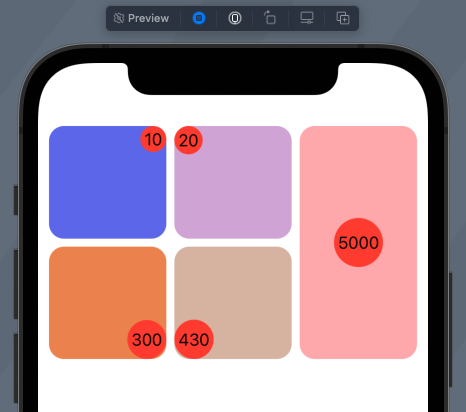
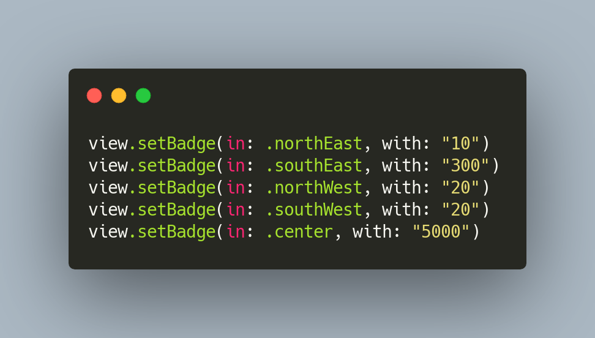

# Badge Generator

Generate a "badge" (circular label) for any view and place it in the center or any corner of a given view

Badge Generator uses a lightweight, easy to understand approach to make a circular UILabel with the given text

- platform: iOS
- extends: UIView
  - @discardableResult public func setBadge(in direction: BadgeDirection, with text: String) -> BadgeLabel<br>
    - adds a new badge to the view in the given location (BadgeDirection) <br>
    
### Installation:

In your Xcode project, simply go to File -> Swift Packages -> Add Package Dependency.
Then use this repo's URL: https://github.com/froggomad/BadgeGenerator

### Usage:

#### Create, position, and hold reference to a badge

```swift
let myView = UIView()
let badge = myView.setBadge(in: .northWest, with: "1")
```

#### Increment an integer value by `n`
##### This increments the value if it can be converted to Int and update's the badge's text
```swift
badge.incrementIntValue(by: 1)
```

#### Attempt to increment an integer value, and get the result back
##### It will fail if the `text` value can't be converted to `Int`
```swift
let value = badge.incrementIntValue(by: 1)
switch value {
    case let .success(intValue):
        print(intValue)
    case let .failure(error):
        print(error)
}
```

#### Change a badge's text to "foo"
```swift
badge.set("foo")
```

#### Remove a badge
```swift
badge.remove()
```

### Example Badges
These badges are placed on a `PreviewProvider`, but you can place them on any UIView or in SwiftUI using UIViewRepresentable




### Contributing to this project:

If you notice a bug, or think of a feature you'd like to add, please raise a GitHub issue using the appropriate template


#### Completed Bug Report


#### Fixing Issues
Outstanding [issues](https://github.com/froggomad/BadgeGenerator/issues) are a great place to start contributing. If you notice an issue that isn't in the tracker, please open an issue in the [issue tracker](https://github.com/froggomad/BadgeGenerator/issues) and indicate that you're working on a fix by commenting on the issue. Once you've done this, the open source community has a chance to chime in and help out as well!

To get started, fork the repo and create a new branch with the format `issueNumber/issue-description` i.e. `1/increment-int-values`

Once you believe the issue is fixed, make sure the tests pass (press cmd+u or go to the test target and click the "play" button next to the class name). Then open a Pull Request.

Once we receive your pull request, we'll review it, provide you with feedback, and potentially add it to the codebase!
